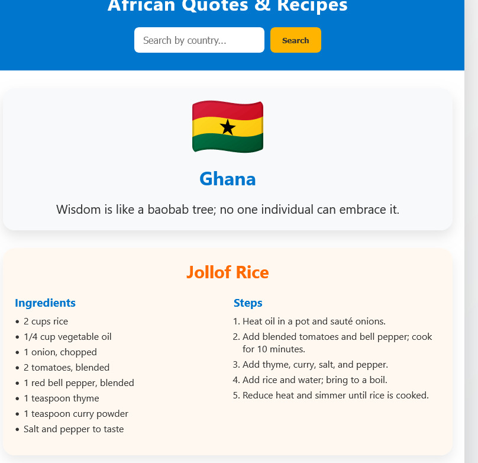

# African Quotes & Recipes App 🌍🍲

A culturally rich web app that celebrates African wisdom and cuisine. Each country features a **unique traditional proverb** paired with a **national dish** — offering users a taste of Africa's diversity and heritage.

---

## 🖼️ Screenshot Placeholder



---

## 🌟 Features
- 30 African countries with curated proverbs and dishes 🇰🇪🇳🇬🇿🇦  
- Culturally authentic and responsive design  
- Randomized country generator  
- Optimized for performance and accessibility  
- Built for learning, sharing, and celebrating African culture

---

## 🛠️ Technologies Used
- **React.js** – Frontend framework  
- **Tailwind CSS** – Modern, responsive styling  
- **Vite** – Fast development environment  
- **GitHub Pages** – Deployment

---

## 🚀 Getting Started

### 1️⃣ Clone the repository
```bash
git clone https://github.com/yourusername/african-quotes-recipes.git
cd african-quotes-recipes
